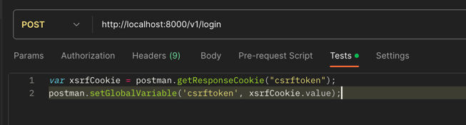
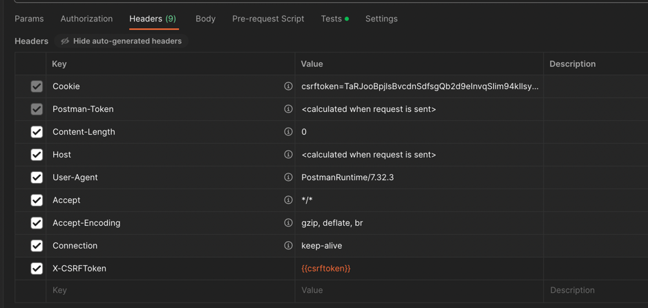

# ktx_gacha

---

## settings
* python 3.8
* django 
* selenium

---

## 러프한 일정
8월 중 매크로 기능 1차 테스트형 완성.

---

# ***Todo***
### process
1. 플로우 차트
2. 티켓 검색 조건 (to - go, 날짜,좌석, 등급, 인원)
2. 실제 예약까지 소요 시간
3. 리소스 필요 정도

### code level
1. 요청 URL hard coding 제거
2. tag id 등 바뀔 경우 어떻게 대처 할 지 고민 필요.

### 매크로 기능 관련
1. 로그인 
2. 목록 조회
3. 조건에 따른 타겟 선정
4. 예약을 위한 검색 반복 - 선택 결제 대기 또는 장바구니 ( 20 분 내로 결제 필요 )
5. 2인 이상일 경우 좌석 선택 방식 확인 필요. - 추후 구현 예정.
   1. 붙어서 선택  
   2. 나뉘어서 선택. 
   3. 창측, 통로층, 역방향, 순방향 등 옵션 많음. + 특실/우등실 , 일반실  
6. 하나만 선택하던지, 범위에 해당하는 표를 선택하던지.  
   1. 표를 어떤 기준으로 선택하는지 확인 필요 ( 예약 요청 기준 ) -- gacha니까 랜덤으로 주는것도 방법인가  
   2. 특정 시간대를 하나 설정 ( 정각 기준 ) 이후 8~9개 정도의 시간표가 나오는데 보통 선택 시간과 3시간 정도 차이가 나는 듯 ( 역마다 다름 )   
    

### 프로젝트 세팅
1. env 설정으로 코드값들 변경
2. DB 사용 여부

### 사용자 연계
1. 외부 API 연동 ( 카카오 채널 또는 슬랙 )

---

### TEST postman settings

https://buildabetterworld.tistory.com/75

---

### Flow chart

